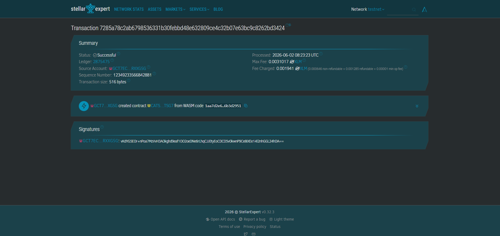

# Title
Peer Tutoring Payment Portal

# Description
This project records peer tutoring sessions in SQLite and settles campus token payments on Stellar using Soroban.
It exists to make tutoring payouts transparent, auditable, and easy to sync between the app database and the blockchain.

# Project Vision
Build a campus-native payment flow where every tutoring session is tracked, every payout is traceable, and every settlement can be verified on-chain.
The long-term goal is to create a reliable Stellar-based backend for tutoring marketplaces, campus services, and verified student work.

# Features
- Soroban escrow contract for session payment release
- SQLite persistence for users, sessions, confirmations, and settlement history
- Backend sync flow for creating sessions, recording confirmations, and submitting payout transactions
- Optional Soroban CLI wiring for pushing approved session states on-chain
- Cancellation support before payout finalization
- Validation for duplicate sessions, invalid amounts, and unauthorized session changes

# Getting Started
This section explains how to run the backend and contract locally for development.

Prerequisites:
- Rust toolchain and Cargo
- Python 3.10+
- Optional: `stellar` CLI if you plan to submit session updates on-chain

Backend (development):

PowerShell example:
```powershell
cd backend
# Optional chain wiring:
# $env:CONTRACT_ID = "your-contract-id"
# $env:CONTRACT_SOURCE = "your-source-account"
# $env:CONTRACT_NETWORK = "testnet"
# $env:TOKEN_CONTRACT = "your-token-contract-id"
python main.py demo
```

Bash example:
```bash
cd backend
export CONTRACT_ID=your-contract-id
export CONTRACT_SOURCE=your-source-account
export CONTRACT_NETWORK=testnet
export TOKEN_CONTRACT=your-token-contract-id
python main.py demo
```

After the script starts you should see a log like `session 1 synced and marked paid` when chain wiring is configured.
Available backend commands:
- `python main.py init-db` — create or refresh the SQLite schema
- `python main.py demo` — run a sample tutoring session flow
- `python main.py sync-session --session-id 1` — sync one session to chain

Contract build and test:
```bash
cd contracts/tutoring
cargo test
```

Quick test using SQLite data only:
```bash
python backend/main.py demo
```

# Contract
Contract key: CATSRPLN4NWKV3SI7O5POTWZ466UIZNMMFU4WRVHD3MXBJAFEJMNTSG7

Contract link: https://stellar.expert/explorer/testnet/contract/CATSRPLN4NWKV3SI7O5POTWZ466UIZNMMFU4WRVHD3MXBJAFEJMNTSG7

Contract screenshot:



# Future scopes
- Add a frontend dashboard for tutor bookings and payment status
- Add admin review and manual dispute handling
- Support direct wallet-driven confirmation flows instead of only backend sync
- Add richer analytics for session volume and payout history
- Improve deployment automation for testnet and mainnet

# Profile
Name: Vo Dinh Long
Skills: Rust, Soroban, SQLite, Python, API design, blockchain backend development
Focus: Building transparent Stellar-native payment infrastructure
